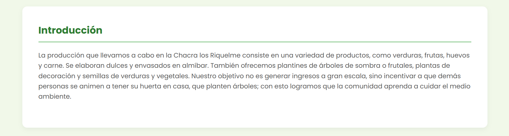
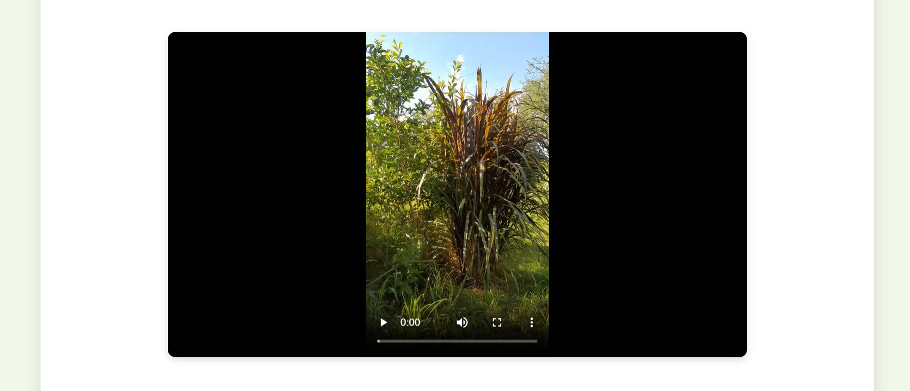
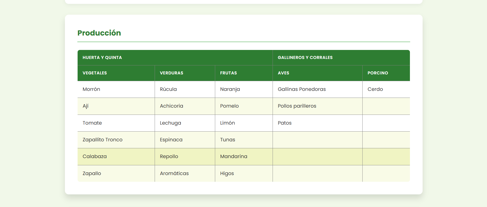
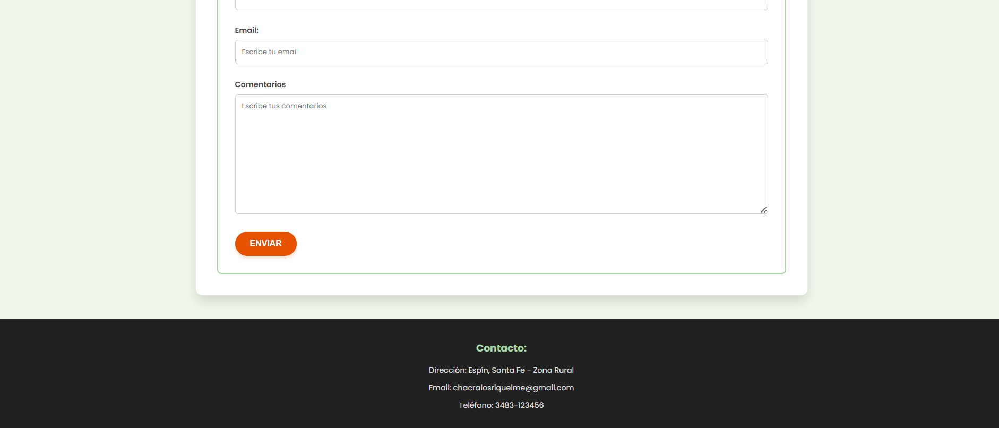

# Proyecto Integrador - Chacra los Riquelme

## Breve descripción
Pagina web que muestra la producción orgánica de una chacra y quinta familiar.
## Contenido incluido
- index.html: Página principal con navegación, secciones de presentación, introducción, imágenes, producción, finanzas y contacto.
- imagenes: Carpeta con imagen de ícono
- imagenes2: Carpeta con fotos de la producción (cultivos, animales, productos).
- Capturas de pantalla de la pagina: Carpeta con 8 capturas de pantalla de la web.
- README.md: Éste archivo de documentación.

## Capturas de pantalla
A continuación se muestran las capturas de pantalla de la página:

## Autor
Valentín Riquelme

