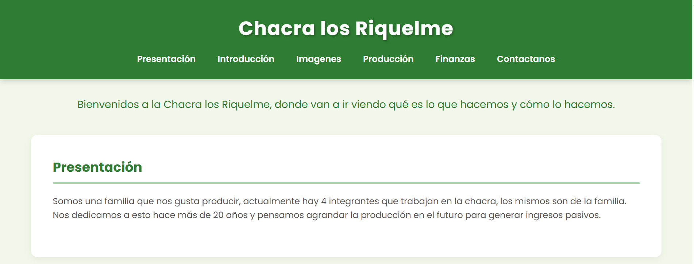
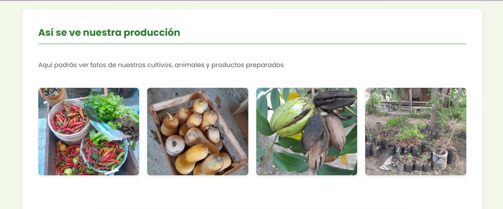
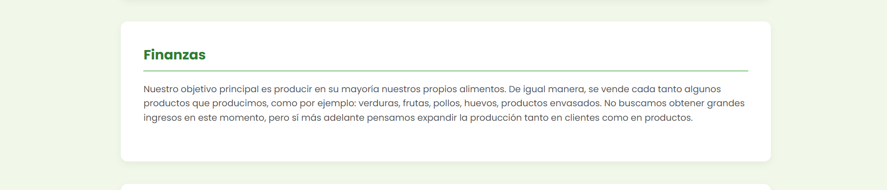
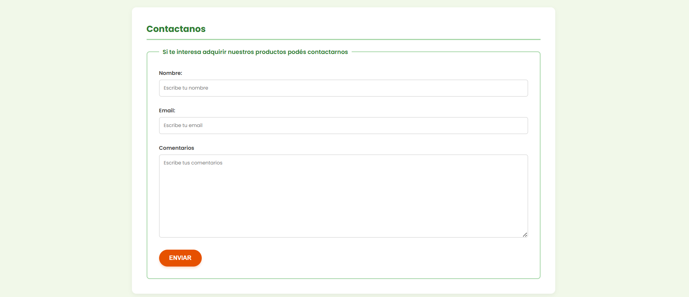

# Proyecto Integrador - Chacra los Riquelme

## Breve descripción
Pagina web que muestra la producción orgánica de una chacra y quinta familiar con un buen diseño.
## Contenido incluido
- index.html: Página principal con navegación, secciones de presentación, introducción, imágenes, producción, finanzas y contacto.
- styles.css: diseño y estilo del html
- imagenes: Carpeta con imagen de ícono
- imagenes2: Carpeta con fotos de la producción (cultivos, animales, productos).
- capturas-pantalla: Carpeta con 8 capturas de pantalla de la web.
- README.md: Éste archivo de documentación.

## Capturas de pantalla
A continuación se muestran las capturas de pantalla de la página:

## Incorporación de Interactividad con JavaScript
Para finalizar el proyecto "Chacra los Riquelme", donde anteriormente se utilizo tecnologia html y css, ahora, se incorporó interactividad y función a la página con tecnología de JavaScript.

### Tecnologías Aplicadas
_ HTML5 (Estructura semántica del ecosistema rural)
_ CSS3 (Diseño adaptable mediante Grid, Flexbox y Variables de raíz)
_ JavaScript Moderno (ES6+) (Manipulación avanzada de la interfaz y lógica programática)

### Funcionalidades Añadidas
1. Buscador Dinámico e Inteligente: Un componente reactivo inyectado mediante código nativo que procesa un array estructurado de la producción de la chacra, permitiendo búsquedas por caracteres en tiempo real y segmentación selectiva por rubros.
2. Validación Preventiva y Manejo Excepcional de Errores: Optimización del formulario tradicional mediante capturas controladas bajo estructuras `try...catch`. Inspecciona campos vacíos e inconsistencias en cadenas de correos inyectando banners específicos de advertencia visual sin interrumpir la experiencia de navegación.
3. Persistencia e Integración de Código Limpio: Desarrollo estructurado de forma asíncrona modular, desvinculando por completo cualquier código lógico en línea dentro de las etiquetas estructurales primarias.

## Autor
Valentín Riquelme

